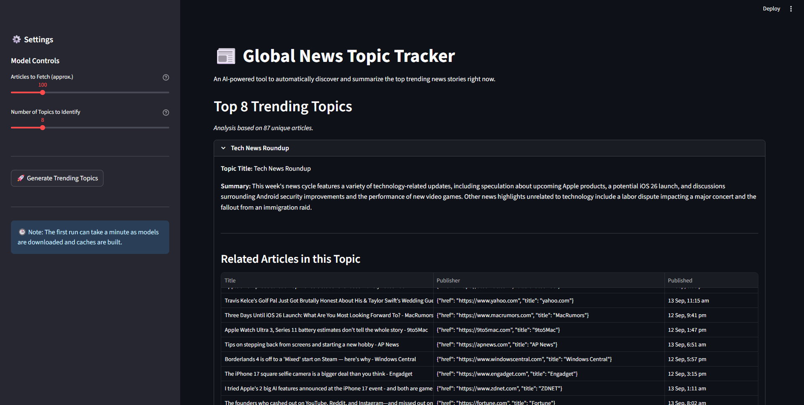
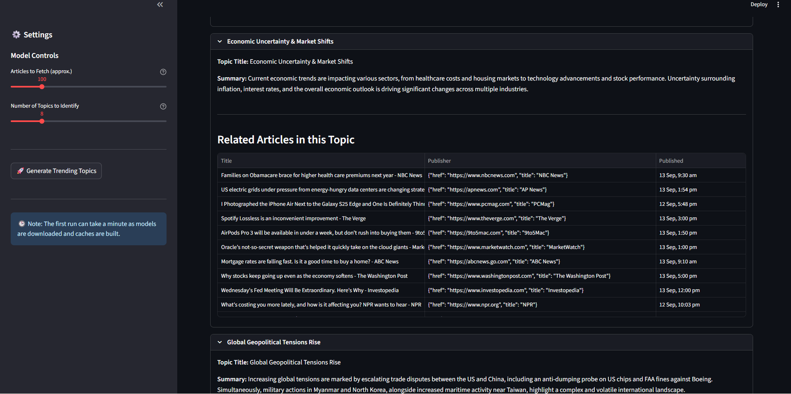

# 🌐 Global News Topic Tracker

An **AI-powered Streamlit web application** that automatically fetches the latest global news, identifies trending topics using machine learning, and generates concise summaries using the Google Gemini Large Language Model (LLM).

This project helps users quickly understand what’s trending worldwide without reading dozens of articles.

---

## 🚀 Features

### 📰 Automated News Aggregation

* Fetches latest articles from multiple categories:

  * Top News
  * World
  * Technology
  * Business
* Combines and processes them into a unified dataset

### 🤖 AI-Powered Topic Clustering

* Uses **sentence-transformers** to generate vector embeddings from news headlines
* Applies **KMeans clustering** (scikit-learn) to group similar articles
* Identifies distinct trending topics automatically

### 🧠 LLM-Generated Summaries

* Sends clustered articles to **Google Gemini LLM**
* Generates:

  * A concise topic title
  * Neutral multi-sentence summary
* Provides easy-to-read insights for each topic

### 💻 Interactive UI

* Built with **Streamlit** for a clean and simple interface
* Users can:

  * Choose number of articles to fetch
  * Select number of topics to generate
  * View summaries and related articles

### ⚡ Optimized Performance

* Caches expensive operations such as:

  * News fetching
  * Topic clustering
  * LLM summarization
* Ensures faster performance on repeated runs

### 🔐 Secure API Key Handling

* Uses `.env` file to store API keys securely
* Keeps sensitive credentials out of source code

---

## 🧰 Tech Stack

**Core Framework:**

* Streamlit

**Data Handling:**

* Pandas

**News Source:**

* gnews

**NLP & Clustering:**

* sentence-transformers
* scikit-learn (KMeans)

**AI Summarization:**

* Google Generative AI (Gemini 1.5 Flash)

**Environment Variables:**

* python-dotenv

---

## 🛠 Setup and Installation

Follow these steps to run the project locally.

### 📌 Prerequisites

Make sure you have:

* Python 3.8+
* pip package manager

---

### 1️⃣ Clone the Repository

```bash
git clone repository
cd your-repo-name
```

---

### 2️⃣ Install Dependencies

Install required Python packages:

```bash
pip install -r requirements.txt
```

---

### 3️⃣ Set Up Your API Key

This project requires a **Google AI API Key**.

Create a `.env` file in the project root directory and add:

```env
GOOGLE_API_KEY="AIzaSy...your...actual...api...key"
```

You can generate your API key from **Google AI Studio**.

---

## ▶️ How to Run the Application

Run the Streamlit app using:

```bash
streamlit run app.py
```

Your browser will automatically open the application.

---

## 🧑‍💻 Using the App

1. Use the sliders in the sidebar to:

   * Select number of articles to fetch
   * Select number of topics to identify

2. Click **"🚀 Generate Trending Topics"**

3. The app will:

   * Fetch latest news
   * Cluster topics
   * Generate AI summaries

4. Results will appear as expandable sections showing:

   * Topic title
   * AI-generated summary
   * Related news articles

---

## 🖥 Streamlit Interface

### Main Interface



### Topic Display



---

## 📈 Use Cases

* Track global trending topics
* Market and technology research
* Media monitoring
* Content research and analysis
* AI/ML project demonstration

---

## 🔮 Future Enhancements

* Real-time news streaming
* Topic sentiment analysis
* Historical trend tracking
* Dashboard analytics
* Multi-language news support
* Deployment on cloud (AWS/GCP/Azure)

